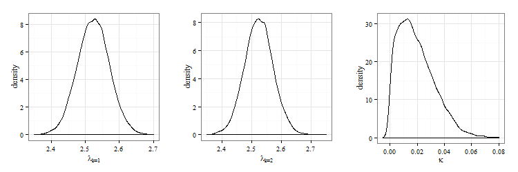

# Problem Statement | Trans-dimensional problems

## Primary Goal

To solve problems where
*"...the number of things you don’t know is one of the things you don’t know!"*

# What is RJMCMC?

## RJMCMC makes you wanna...

## Reversible Chain {.smaller}

  - A *reversible Markov chain* is one which the transition distribution $P$ satisfies the *detailed balance condition*.
  - The *detailed balance condition* states for all Borel sets $A, B \subset \mathcal{X}$:
  
    $$
    \int_{(x, x') \in A \times B} \pi(dx) P(x, dx') = \int_{(x, x') \in A \times B} \pi(dx') P(x', dx)
    $$  

<iframe scrolling="no" style="display: block; float: left;" width="100%" height="50" src="http://setosa.io/markov/no-controls-with-hash.html#%7B%22tm%22%3A%5B%5B0.5%2C0.5%5D%2C%5B0.5%2C0.5%5D%5D%7D"></iframe>

What does this say? It says that there is perfect balance between the probability flow from state to state, you can reverse the direction of state transition and nothing has changed in terms of the flow.

This assumption is actually the commonly made assumption in MCMC, including Metropolis-Hastings sampling,  and it becomes of prime importance in reversible jump mcmc were we are not only transitioning within model (changing parameters), but also between models.

## For Model Selection
Scenario:

  - Have a *countable* collection of models: $\{\mathcal{M}_k: k \in \mathcal{M}\}$
  - Each model $\mathcal{M}_k$ has unknown parameter vector $\boldsymbol \theta_k$
  - Length of parameter vector may vary from model to model
  - Notation: $(k, \boldsymbol \theta_k)$ refers to model $k$ and its parameter vector
  - Notation: $\pi(\theta_{k})$ is the target distribution 

## Algorithm (model selection)
If the current state of the chain is $(k, \boldsymbol \theta_k)$, then:

  1. Propose a new model $\mathcal{M}_{k^*}$ with probability $j(k^*| k)$.
  2. Generate $\boldsymbol u$ from a specified proposal density $g(\boldsymbol u)$
  3. Set $(\boldsymbol \theta_{k^*}^*, \boldsymbol u^*) = h'(\boldsymbol \theta_k, \boldsymbol u)$ where $h'$ is a bijection between $(\boldsymbol \theta_k, \boldsymbol u)$ and $(\boldsymbol \theta^*_{^*}, \boldsymbol u^*)$ where the following must hold: $dim(\boldsymbol \theta_k) + dim(\boldsymbol u) = dim(\boldsymbol \theta^*_{k^*}) + dim(\boldsymbol u^*)$.
  4. Accept the proposed move to $(k^*, \boldsymbol \theta_{k^*}^*)$ with probability
  
      $$
      \alpha = \min\left\{1, \frac{\pi( \theta_{k^*}^*) j(k^*| k) g'(\boldsymbol u^*)}{\pi(\boldsymbol \theta_k) j(k|k^*) g(\boldsymbol u)} \left|\frac{\partial h'( \theta_{k^*}^*, \boldsymbol u^*)}{\partial (\boldsymbol \theta_k, \boldsymbol u)}\right|\right\}
      $$
      
      Where $u^* \sim g'$ [@chen2000monte, pp. 303]

## For Bayesian Model Selection

  - Assign each $\mathcal{M}_k$ a prior probability $p(k)$
  - Target distribution becomes the posterior distribution of each model, $\pi(\boldsymbol{ \theta_{k}}|D,\mathcal{M}_{k})$, where $D$ is the data
  - Acceptance probability becomes 
  
      $$
      \alpha = \min\left\{1, \frac{p(k^*)\pi( \theta_{k^*}^*|D,\mathcal{M}_{k^*}) j(k^*| k) g'(\boldsymbol u^*)}{p(k)\pi(\boldsymbol \theta_k |D,\mathcal{M}_k ) j(k|k^*) g(\boldsymbol u)} \left|\frac{\partial h'( \theta_{k^*}^*, \boldsymbol u^*)}{\partial (\boldsymbol \theta_k, \boldsymbol u)}\right|\right\}
      $$

  - Posterior model probability is $\hat{p}(k | D) = \frac{1}{L} \sum\limits_{l = 1}^L \mathcal{I}(k_l = k)$ where $L$ is the length of the MCMC chain and $k_l$ is the model chosen at iteration $l$. 

# Example

## Poisson vs Negative Binomial Model | [@green2009reversible] {.smaller}
If count data are overdispersed relative to the Poisson distribution, the Negative-Binomial distribution may be more appropriate.

  - Soccer data: Total goals from 1,140 English Premier league games, 2005/2006 to 2007/2008 seasons
  - Is data better modeled using Poisson or Negative-Binomial distribution?
  
Under an identically distributed Poisson model, one parameter $\lambda > 0$

  $$
  \mathcal{L}(Y|\lambda) = \prod_{i=1}^N \dfrac{\lambda^{Y_i}}{Y_i!}e^{-\lambda}
  $$

Under an identically distributed Negative-Binomial model, two parameters $\lambda > 0$, $\kappa > 0$

  $$
  \mathcal{L}(Y|\lambda, \kappa) = \prod_{i=1}^N \dfrac{\lambda^{Y_i}}{Y_i!} \dfrac{\Gamma \left(1/\kappa + Y_i\right)}{\Gamma \left(1/\kappa\right)\left(1/\kappa + \lambda\right)^{Y_i}}\left(1+\kappa \lambda\right)^{-1/\kappa}
  $$  

## The Problem Setup {.smaller}

  - $\lambda \sim$ Gamma($\alpha_{\lambda}$, $\beta_{\lambda}$)
  - $\kappa \sim$ Gamma($\alpha_{\kappa}$, $\beta_{\kappa}$)
  - $P(k=1) = P(k=2) = 0.5$
  
Under Model $k = 1$, let $\theta_1 = \lambda$

  - $Y_i \sim$ Poisson($\lambda$)
  - $\lambda | k=1 \sim \text{Gamma}(\alpha_{\lambda}, \beta_{\lambda})$

Under Model $k = 2$, let $\theta_2 = (\lambda, \kappa)$

  - $Y_i \sim$ NegBin($\lambda$, $\kappa$)
  - $\lambda, \kappa | k=2 \sim \text{Gamma}(\alpha_{\lambda}, \beta_{\lambda}) \times \text{Gamma}(\alpha_{\kappa}, \beta_{\kappa})$

Posterior Distribution 

  $$
  \pi(k, \theta_k| Y) = \begin{cases}
    \frac{1}{2} \mathcal{L}(Y|\lambda) \text{Gamma}(\alpha_{\lambda}, \beta_{\lambda}) & k=1\\
    \frac{1}{2} \mathcal{L}(Y|\lambda) \text{Gamma}(\alpha_{\lambda}, \beta_{\lambda}) \text{Gamma}(\alpha_{\kappa}, \beta_{\kappa}) & k=2\\ 
    \end{cases}
  $$
  
## RJMCMC to move between models {.smaller}

Since the two models are of differing dimensions, need reversible jump to move between models.

**Move from Model 1 to Model 2**

  - Let $g$ be the $N(0,\sigma^2)$ density for fixed $\sigma$. Generate $u$ from $g$.    
  - Let $x = (1, \theta)$. Set $x' = (2, \theta')$, where
    
    $$ 
    \theta' = h(\theta, u) = (\theta, \mu e^u)
    $$

    for fixed $\mu$.

**Move from Model 2 to Model 1**

  - To ensure detailed balance condition holds, let 
    $$
    (\theta, u) = h'(\theta') = (\theta', log(\theta_2'/\mu))
    $$
  - Doesn't require new random variable $u'$. 
    
    $$
    u' = log(\theta_2' / \mu)
    $$

## Acceptance probabilities {.smaller}

Let $m=\left\{(1,2), (2,1)\right\}$. 

  - $\alpha_m(x,x') = \text{min}\left\{1, A_m(x, x') \right\}$ where
  $$
  A_m = \dfrac{\pi(x')j_m(x')g_m'(u')}{\pi(x)j_m(x)g_m(u)}\left\vert \dfrac{\partial(\theta_k', u')}{\partial (\theta_k, u)}  \right\vert
  $$
  
**Model 1 -> Model 2**

  $$
  |J| = \left\vert \begin{array}{cc}
  \dfrac{\partial \theta}{\partial \lambda} & \dfrac{\partial \theta}{\partial u}\\
  \dfrac{\partial \mu e^u}{\partial \lambda} & \dfrac{\partial \mu e^u}{\partial u}\\
  \end{array}\right\vert = \left\vert
  \begin{array}{cc}
    1 & 0\\
   0 & \mu e^u\\
  \end{array}\right\vert = \mu e^u
  $$

**Model 2 -> Model 1**

  $$
  |J| = \left\vert \begin{array}{cc}
  \dfrac{\partial \theta}{\partial \lambda} & \dfrac{\partial \theta}{\partial u'}\\
  \dfrac{\partial log(\theta_2'/\mu)}{\partial \lambda} & \dfrac{\partial log(\theta_2'/\mu)}{\partial \theta_2'}\\
  \end{array}\right\vert = \left\vert \begin{array}{cc}
    1 & 0\\
   0 & (\mu/\theta_2')\mu\\
  \end{array}\right\vert = 1/\theta_2'
  $$

## Acceptance probabilities, cont. {.smaller}

**Move from Model 1 to Model 2**

  $$
  A_{1,2} = \dfrac{\pi(2, \theta')}{\pi(1, \theta)} \left\{\dfrac{1}{\sqrt{2\pi\sigma^2}} \text{exp} \left\lbrack \dfrac{-u^2}{2\sigma^2} \right\rbrack \right\}^{-1} \mu e^u
  $$

**Move from Model 2 to Model 1**
  $$
  A_{2,1} = \dfrac{\pi(1, \theta)}{\pi(2, \theta')} \dfrac{1}{\sqrt{2\pi\sigma^2}} \text{exp} \left\lbrack \dfrac{-log(\theta_2'/\mu)^2}{2\sigma^2} \right\rbrack  \frac{1}{\theta_2'}
  $$

## Illustrated algorithm

</img>

## Results

  - 50,000 iterations with burn-in of 5,000 iterations
  - $p(k=1|\theta, y) = 0.71$, $p(k=2|\theta, y) = 0.29$  
  

## Changepoint Problem - HW 7

very unlikely this I will finish this/get to run, but if so will briefly summarize here

# Challenges for implementation

## The Challenges Aren't What You Think

Implementing reversible algorithms may seem difficult for several reasons. 

  - Much of the work being reported is from the perspective of MCMC "experts"
  - The language required to present these samplers is necessarily complex

These issues are not the cause of difficulty though
  
  - In the practical sense, implementation is *actually* fairly easy 
  - Very few areas require a detailed understanding of the underlying theorhetical framework 
  - There is little justification needed to garuntee a sampler is able to simulate from a target

## Efficiency

The main issue is usually not whether a proposal mechanism will work, 
but whether it will work effeciently.

  - Ineffecient chains are slow to explore the support of the target distribution
  - Taking more *time* to converge to the target distribution

The tuning for a specific problem can be arduous, 
which has lead to work on finding useful general techniques for 
selecting parts of the mechanism.

## General Approaches to Improve Efficiency

Improving efficiency requires the proposed state $(k', \theta'_{k'})$ 
and the existitng state $(k, \theta_k)$ have similar state spaces.

There are two main classes of methods for ensuring this:

  - *Order methods*: parameterizing proposals (our $g(u)$) for a given $h(\theta, u) = (\theta', u')$.
  - *Saturated state*: augment the state space $\mathcal{X}$ with auxiliary variables

## Order methods

  - For a given initial state $\theta_k$ in model $k$ we can find an equivalent state $c_{k,k'}(\theta_k)$ in model $k'$.  
  - We call these equiavlent states are called "centering points"
  - If we constrain $A((k,\theta_k), (k', c_{k,k'}(\theta_k)$ to be, say, 1, then moving from one model ($k$) to another ($k'$) will be encouraged and the state space will be more thoroughly explored.
  
The *order* of the method determines the type of constraint imposed:

  - $0^{th}$-order: $A((k,\theta_k), (k', c_{k,k'}(\theta_k) = 1$
  - $k^{th}$-order: $\nabla A((k,\theta_k), (k', c_{k,k'}(\theta_k) = \mathbf{0}$

## Saturated State Space Approach

  - For a given state space $\mathcal{X}$ add additional "auxiliary" variables so that each model has the same number of parameters as the largest model.
  - This means that changing between models with different numbers of parameters is equivalent to changing the auxiliary variables in or out
  - Between state changes become more likely meaning the sampler covers the set of possible proposals more quickly

## Other Ways to Improve Proposals

  - Adaptive sampling: using past observations (even rejected ones) to make mid-run adjustments to the proposal

     - Type 1: *diminishing* - continuous adaptation, but at a decreasing rate
     - Type 2: *through regeneration* - if regions of the state space exists where incoming chains are likely independent of outgoing chains, adapt as chains enter and leave them

  - Delayed rejection: if proposal $x'$ is rejected, try a backup proposal $x''$

## Finding Appropriate Diagnostics

  - The main issue in improving efficiency is in promoting transitions between models - transitions between state space dimensions.
  - However, when the dimension of the state space is large, it is difficult to imagine any single scalar-valued statistic that could work as a gatekeeper in a general sense.
  - Transitioning between models is not always the favored choice 
     - Chains may "stabilize" quickly inside a model 
     - Meaning the chain provides good diagnostics 
     - **Until** the chain moves to sample from a different model
     - At which point the diagnostics 
  - Recent work is focused on accounting for the differences in "within" run and "between" run variability
     - Meaning finding ways account for how much disruption in chain behavior is natural when switching dimensions
     - Similar to "within" model and "between" model variability to account for expected departure from modeled behavior

# Beyond...

## Extensions to...

  - Adaptive RJMCMC [@hastie2005towards]
  - Interacting Sequential MCMC [@jasra2008interacting]
  - Simulated Annealing extended for trans-dimensionsal problems [@geman1984stochastic]

  - Efficiency gains - adaptive sampling. Idea: proposal mechanisms may be allowed to depend on past realizations of the chain, not just current state without invalidating ergodicity of process. Optimal location and scaling of proposal can be determined during run, eliminating tuning.
  - ISMC - Several sequential MC samplers run in parallel, separate subspaces. For each sampler at time $t < T$, particles updated using (reversible) MCMC moves. When a predetermined time $t^* < T$ is reached, the separate samplers are combined into a single sampler moving across all models.
  - Simulated annealing where an optimal model may need to be determined. I.e., function $f$ quantity to minimize with some penalization terms. Trans-dimensional simulated annealing proceeds by using reversible jump moves to construct a Markov chain with appropriate invariant dsn. Once equilibrium achieved, temperature is decreased and new phase is started from the state the chain ended in.

## Alternatives to... | for trans-dimensional problems

  - Jump diffusion [@grenander1994representations]
  - Marked point processes [@stephens2000bayesian]
  - Product Space approach [@carlin1995bayesian]
  

   - Jump diffusion - between model jumps and within model diffusion according to Langevin stochastic differential equation - time evolution of a subset of the degrees of freedom
   - Marked point - variable number of items regarded as marked points (component pairs), borrows from birth-and-death simulation idea (integrating out latent variables)
   - Product space - work on a more general state space, where the simulation keeps track of all $\theta_k$ instead of the current one, then the state vector is of fixed dimension avoiding trans-dimensional problem

# Appendix

## Development of $\alpha$ {#appendix}

**Metropolis-Hastings on a general state space**

To construct a Markov chain on a state space $\mathcal{X}$ with invariant distribution $\pi$. We will only consider reversible chains, so the transition kernel $P$ satisfies the detailed balance condition

$$
\int\limits_{(x, x') \in A \times B} \pi(dx)P(x, dx') = \int\limits_{(x, x') \in A \times B} \pi(dx')P(x', dx)
$$

for all Borel sets $A,B \subset \mathcal{X}$. We make a transition by frawing a candidate new state $x'$ from the proposal measure $q(x, dx')$ and accepting it with probability $\alpha(x, x')$. We we reject, we stay in the current state so that $P(x, dx')$ has an element at $x$. This constributes $\int_{A\cap B} P(x, \{x\}) \pi(dx)$ to each side of the balance equation; subtracting leaves

$$
\int\limits_{(x, x') \in A \times B} \pi(dx)q(x, dx')\alpha(x, x') = \int\limits_{(x, x') \in A \times B} \pi(dx')q(x', dx)\alpha(x', x)
$$

Now $ \pi(dx)q(x, dx')$ is dominated by a symmetric measure $\mu$ on $\mathcal{X} \times \mathcal{X}$ and let its density wrt $\mu$ be denoted $f$. Then the above equality becomes

$$
\int\limits_{(x, x') \in A \times B} \alpha(x, x')f(x, x')\mu(dx, dx') = \int\limits_{(x, x') \in A \times B} \alpha(x', x)f(x', x)\mu(dx', dx)
$$

and by the summetry of $\mu$, this is satisfied for all Borel $A,B$ if

$$
\alpha(x, x') = \min\left\{1, \frac{f(x', x)}{f(x, x')}\right\} =  \min\left\{1, \frac{\pi(dx')q(x', dx)}{\pi(dx)q(x, dx')}\right\}
$$

## Development of $\alpha$ Cont'd {#appendix}

**Constructive representation in terms of random numbers**

Let $\mathcal{X} \subset \mathbb{R}^d$ and suppose $\pi$ has a density wrt to the $d$-dimensional Lebesgue measure (also denoted $\pi$). At the current state $x$, we generate $r$ random numbers $u$ from a known joint density $g$ and then form the proposed new state as a deterministic function of the current state and the random numbers so that $x' = h(x, u)$. Then the second equality on the previous slide can be written

$$
\int\limits_{(x, x') \in A \times B} \pi(x) g(u) \alpha(x, x') dx du = \int\limits_{(x, x') \in A \times B} \pi(x') g(u') \alpha(x', x) dx' du'.
$$

Where the reverse transition from $x'$ to $x$ is made with the aid of random numbers $u' \sim g'$ giving $x = \mathcal{H}(x', u')$ and this transformation from $(x, u)$ to $(x', u')$ is a diffeomorphism. Then the $(d + r)$-dimensional integral equality holds if

$$
\pi(x)g(u)\alpha(x, x') = \pi(x') g(u') \alpha(x', x) \left|\frac{\partial(x', u')}{\partial(x,u)}\right|.
$$

Then, a valid choice for $\alpha$ is 

$$
\alpha(x, x') = \min\left\{1, \frac{\pi(x')g'(u')}{\pi(x)g(u)} \left|\frac{\partial(x', u')}{\partial(x,u)}\right|\right\}
$$

[@green2003trans]

## References {#appendix}
