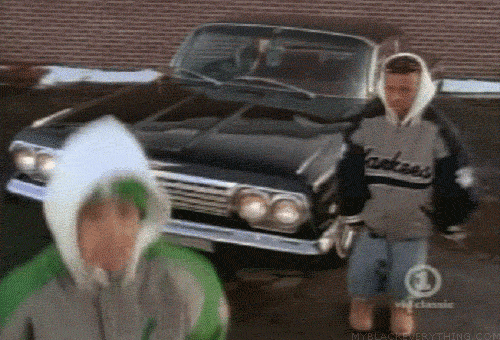

# Problem Statement | Trans-dimensional problems

## Primary Goal

To solve problems where
*"...the number of things you don’t know is one of the things you don’t know!"*

# What is RJMCMC?

## RJMCMC makes you wanna...

## Reversible Chain

  - Definition
  - Animation
  - Detailed balance condition

## Algorithm
This may be moved to paper only, depending on time/detail required

# Example

## Poisson/Negative Binomial Model

# Challenges for implementation

## Choosing priors

## Tuning

## Diagnostics

# Beyond...

## Extensions to...

  - Adaptive RJMCMC [@hastie2005towards]
  - Interacting Sequential MCMC [@jasra2008interacting]
  - Simulated Annealing extended for trans-dimensionsal problems [@geman1984stochastic]

  - Efficiency gains - adaptive sampling. Idea: proposal mechanisms may be allowed to depend on past realizations of the chain, not just current state without invalidating ergodicity of process. Optimal location and scaling of proposal can be determined during run, eliminating tuning.
  - ISMC - Several sequential MC samplers run in parallel, separate subspaces. For each sampler at time $t < T$, particles updated using (reversible) MCMC moves. When a predetermined time $t^* < T$ is reached, the separate samplers are combined into a single sampler moving across all models.
  - Simulated annealing where an optimal model may need to be determined. I.e., function $f$ quantity to minimize with some penalization terms. Trans-dimensional simulated annealing proceeds by using reversible jump moves to construct a Markov chain with appropriate invariant dsn. Once equilibrium achieved, temperature is decreased and new phase is started from the state the chain ended in.

## Alternatives to... | for trans-dimensional problems

  - Jump diffusion [@grenander1994representations]
  - Marked point processes [@stephens2000bayesian]
  - Product Space approach [@carlin1995bayesian]
  

   - Jump diffusion - between model jumps and within model diffusion according to Langevin stochastic differential equation - time evolution of a subset of the degrees of freedom
   - Marked point - variable number of items regarded as marked points (component pairs), borrows from birth-and-death simulation idea (integrating out latent variables)
   - Product space - work on a more general state space, where the simulation keeps track of all $\theta_k$ instead of the current one, then the state vector is of fixed dimension avoiding trans-dimensional problem

# Appendix

## Proofs

## References {#references}

